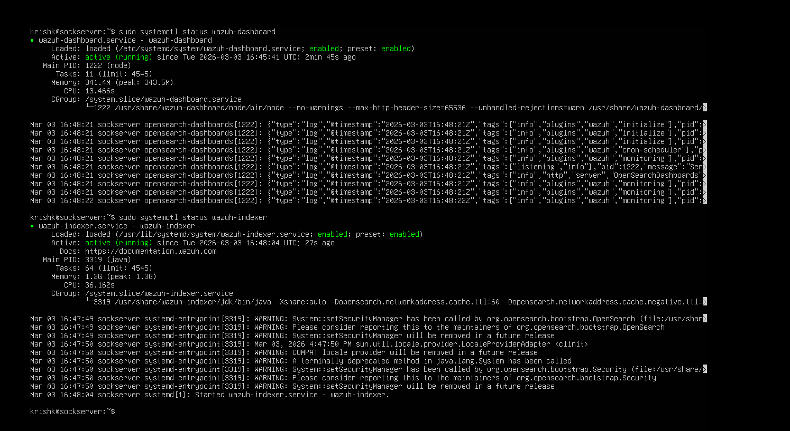
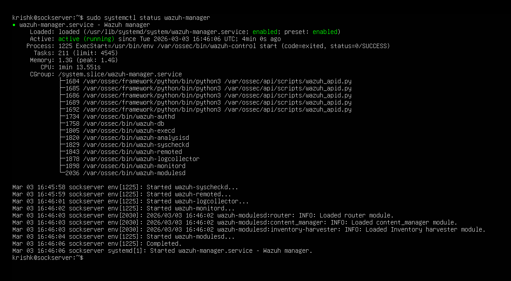
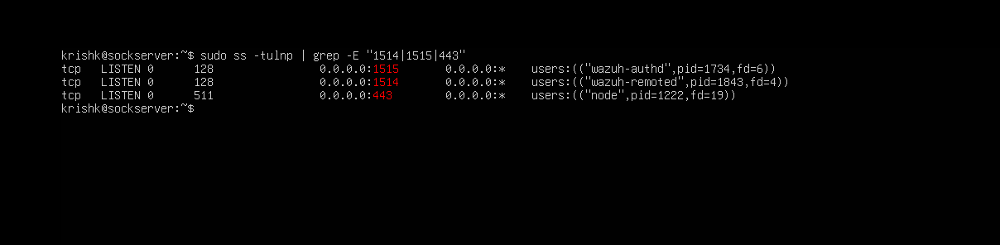
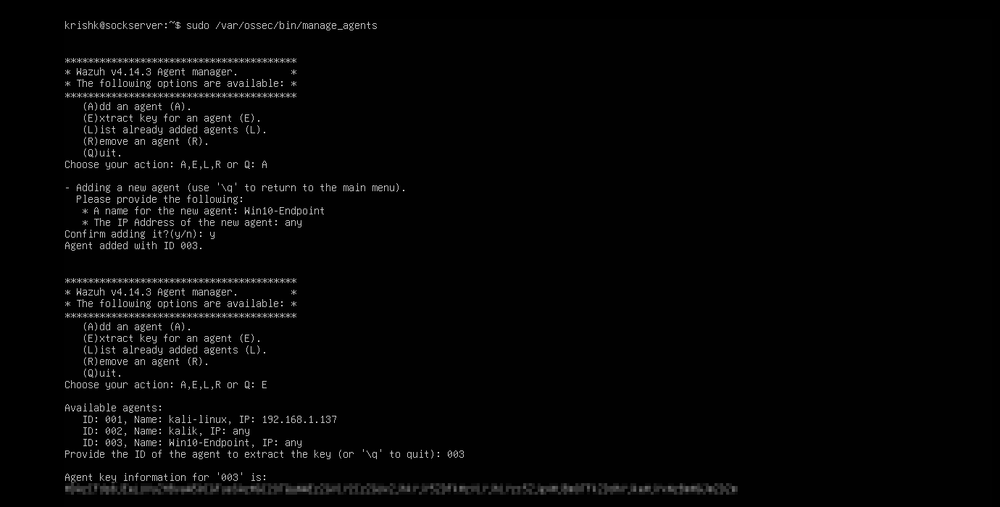

# WORK IN PROGRESS -HOLD YR WIN-DOORS MEANWHILE

# SOC Home Lab – Phase 2: Windows Telemetry & Sysmon Integration

*Windows Endpoint Integration | Security Event Monitoring | Sysmon Telemetry*
---

## 1. Project Overview

This repository documents the second phase of my Security Operations Center (SOC) home lab, focused on expanding monitoring capabilities to include Windows-based telemetry.

Following the successful deployment of a centralized SIEM infrastructure using the Wazuh platform, this phase integrates a Windows 10 endpoint to enhance visibility into operating system–level security events.

The objective of this phase is to:

• Deploy and register a Windows Wazuh agent
• Monitor native Windows Security Event logs
• Integrate and configure Sysmon for enhanced process-level telemetry
• Validate centralized log ingestion within the Wazuh Dashboard
• Troubleshoot agent registration and connectivity issues

By incorporating Sysmon telemetry, this lab extends beyond basic log collection into detailed endpoint activity monitoring, including process creation, command-line execution, and persistence-related events.

This phase transitions the lab from foundational infrastructure deployment into practical Windows endpoint monitoring, closely aligning with real-world SOC analyst workflows.

---

## 2. Lab Objectives & Initial Agent Onboarding

This project focuses on **onboarding a Windows endpoint with Sysmon telemetry** into the existing Wazuh SOC infrastructure and validating that the telemetry is successfully forwarded to the SOC server. The primary objectives are:

* Verify SOC server services are operational
* Confirm required network ports for Wazuh communication are open
* Register the Windows agent securely
* Start and validate the agent service on the Windows VM
* Confirm the agent is active and communicating with the SOC server
* Verify telemetry/log flow is functional

This ensures a **working endpoint-to-SIEM pipeline**, forming the foundation for further log analysis and attack simulation.

---

### 2.1 Windows VM Configuration

The Windows 10 endpoint VM is configured to balance realism with host system constraints (8GB total RAM):

| Resource | Allocation   |
| -------- | ------------ |
| RAM      | 4 GB         |
| CPU      | 2 Cores      |
| Disk     | 40 GB        |
| Network  | VMnet8 (NAT) |
| Sysmon   | Installed    |

This allocation ensures the VM can run **Sysmon** and the **Wazuh agent** while maintaining stability alongside the SOC server and other lab VMs.

---

### 2.2 Verify SOC Server Services

Before onboarding any agent, it is important to ensure that all **Wazuh services** on the SOC server are running and ready to process incoming events.

  

**Services verified:**

* Wazuh Manager
* Wazuh Indexer (OpenSearch)
* Wazuh Dashboard
* Filebeat

---

### 2.3 Confirm Required Ports Are Listening

Ensure the SOC server and Windows endpoint can communicate over the required Wazuh ports:

* **1514:** Agent data communication
* **1515:** Agent registration
* **443:** Wazuh Dashboard access

---

### 2.4 Register the Windows Agent

The Windows agent is registered using the **Wazuh GUI**, and a secure key is generated for authentication.

  
  

The agent is assigned an ID and marked **Active** once connected.

---

### 2.5 Configure and Start Windows Agent

After registration:

1. **Configure the agent in the Wazuh Windows GUI**

2. **Start the Wazuh agent service** on the Windows VM and confirm it is running:

---

### 2.6 Verify Telemetry & Log Flow

Once the agent is active, generate test events via Sysmon and other system activity to validate telemetry:

**Validation ensures:**

* Windows endpoint logs are successfully forwarded to the SOC server
* Wazuh Manager receives and indexes the events
* Events are visible in the Wazuh Dashboard under the agent’s logs

---

